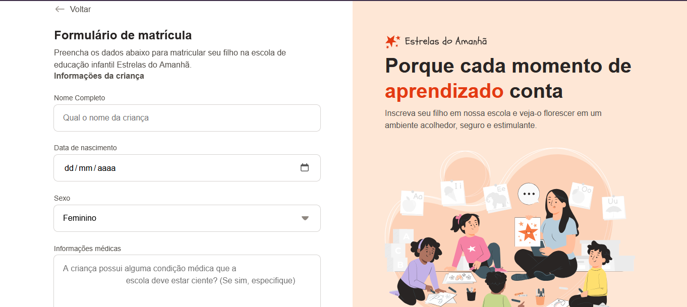

# Formulário de Matrícula 👨🏻‍💻

> Formação Full-Stack: Avançando no HTML e CSS: Layout com CSS (desafio prático)

O site é um formulário para solicitação de matricula de uma escola.

[🔗 Clique aqui para acessar o projeto]()

## 🛠️ Tecnologias

- HTML
- CSS
- Git e Github

## 💜 Contato

maysa.leal0804@gmail.com

---

Feito com ♥ by Rocketseat :wave: [Participe da nossa comunidade!](https://discord.gg/rocketseat)